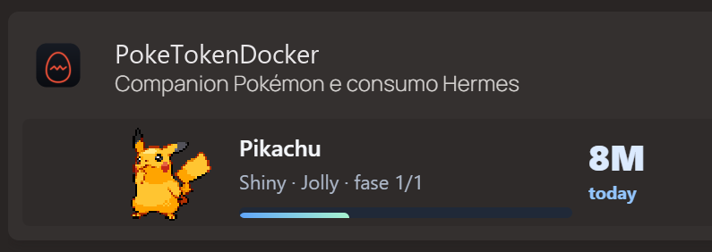

<p align="center">
  
</p>

<h1 align="center">PokeTokenDocker</h1>

<p align="center">
  <strong>Transformez l’usage local de l’IA pour coder en espace Pokémon.</strong><br>
  Un service Docker local-first qui transforme les métadonnées d’utilisation en progression, collection et compagnon web.
</p>

<p align="center">
  <a href="LICENSE"></a>
  <a href="docker/Dockerfile"></a>
  <a href="package.json"></a>
</p>

<p align="center" aria-label="Sélecteur de langue">
  <a href="README.md">🇬🇧 English</a>
  &nbsp;|&nbsp;
  <a href="README.zh-CN.md">🇨🇳 简体中文</a>
  &nbsp;|&nbsp;
  <a href="README.it.md">🇮🇹 Italiano</a>
  &nbsp;|&nbsp;
  <a href="README.ja.md">🇯🇵 日本語</a>
  &nbsp;|&nbsp;
  <a href="README.ko.md">🇰🇷 한국어</a>
  &nbsp;|&nbsp;
  <a href="README.es.md">🇪🇸 Español</a>
  &nbsp;|&nbsp;
  <a href="README.fr.md"><strong>🇫🇷 Français</strong></a>
  &nbsp;|&nbsp;
  <a href="README.pt.md">🇵🇹 Português</a>
</p>

> **Paquet source :** `0.1.1` · build Docker/web · le profil Compose par défaut est `public-readonly`, local et en lecture seule.
>
> **Image publiée :** `ghcr.io/markussela/poketokendocker:0.1.1` · Définissez `PTD_IMAGE` pour utiliser Docker Hub ou un tag local.

## À propos

PokeTokenDocker est la version web headless du concept original du compagnon : l’utilisation locale de l’IA pour coder devient un œuf, puis un compagnon et enfin un Pokédex qui grandit. Le service vise un serveur, un NAS ou une machine locale de confiance où un conteneur Docker peut lire les métadonnées d’utilisation et servir le compagnon dans un navigateur.

Les dossiers Hermes et fournisseurs sont montés en **lecture seule**. Le compagnon n’écrit son propre état dans `/data` qu’après activation explicite d’un profil local avec mutations. Le profil `public-readonly` désactive par défaut achats, réglages, importations et autres mutations.

## ✨ Fonctionnalités

- 🏠 **Espace Web :** Home, Bag, Shop, Pokédex, Catch Log et Settings dans une page responsive.
- 📈 **Progression liée à l’usage :** les métadonnées locales font progresser l’œuf ou le compagnon et enregistrent étapes, rareté, nature et diplôme.
- 📚 **Collection :** le Pokédex conserve les espèces découvertes et le Catch Log les chaînes d’évolution et l’historique.
- 🎒 **Récompenses :** Rare Candy, Mint, Shiny Charm, Poké Doll et niveaux d’œuf appartiennent à l’état du compagnon.
- 🔄 **Mise à jour en direct :** les snapshots et événements SSE arrivent sans recharger toute la page.
- 🧩 **Vue Mini :** [`web/mini.html`](web/mini.html) convient à un Homepage ou iframe de confiance.
- 🌍 **Sept langues :** anglais, italien, coréen, japonais, espagnol, français et portugais.
- 🔒 **Démarrage sûr :** Compose utilise loopback et `public-readonly` par défaut.

## 🔌 Sources locales

Les lecteurs intégrés prennent en charge Claude Code, Gemini, Antigravity, Codex, OpenCode, Cursor, Grok, GitHub Copilot, Kiro, Pi Agent et l’utilisation SQLite locale de Hermes Agent. Des dossiers JSON/JSONL peuvent être ajoutés dans Settings ; le scan reste en lecture seule.

Les quotas officiels ne sont affichés que lorsqu’une source les fournit. Sinon, l’interface l’indique sans inventer de pourcentage ou d’heure de réinitialisation.

## 📸 Captures d’écran

La galerie combine huit captures issues d’une fixture synthétique isolée avec une référence de carte Homepage fournie par le projet. Les captures de la fixture contiennent uniquement des valeurs de démonstration ; l’image de référence a été rebrandée pour cette release et ne contient ni hôte, compte, identifiant ni chemin privé. La politique et l’index complets sont dans [`docs/SCREENSHOTS.md`](docs/SCREENSHOTS.md).

<table>
  <tr><td align="center"></td><td><strong>🏠 Espace.</strong><br>La vue large réunit Home, Bag, Shop et un Pokédex aux noms lisibles. Pikachu shiny est le héros visuel ; Home montre des valeurs synthétiques de tokens et cinq fournisseurs de démonstration.</td></tr>
  <tr><td align="center"></td><td><strong>🧩 Mini dans Homepage.</strong><br>Ce tableau de bord Homepage comprend un en-tête, une recherche, un groupe Services avec une seule carte de service (PokeTokenDocker) et un groupe Bookmarks avec quatre liens publics. La vraie Mini intégrée affiche Pikachu shiny, l’usage synthétique du jour, la progression et le nombre de Pokémon ; les autres conteneurs sont absents pour la confidentialité.</td></tr>
  <tr><td align="center"></td><td><strong>🌐 Aperçu de la carte Homepage.</strong><br>La carte compacte fournie pour cette release utilise l’identité PokeTokenDocker et montre Pikachu shiny, la nature Jolly, la phase 1/1, une progression d’un tiers et l’exemple visible 8M today. Elle ne contient ni hôte, compte, identifiant ni chemin privé.</td></tr>
  <tr><td align="center"></td><td><strong>📊 Home.</strong><br>Pikachu shiny, progression, wallet, totaux synthétiques du jour/de la semaine, cinq fournisseurs, quotas de démonstration et avis lecture seule.</td></tr>
  <tr><td align="center"></td><td><strong>🎒 Bag.</strong><br>La vue Bag séparée affiche Rare Candy, Mint, Shiny Charm et Poké Doll avec leurs icônes et quantités. La limite read-only est visible.</td></tr>
  <tr><td align="center"></td><td><strong>🛍️ Shop.</strong><br>La vue Shop séparée liste les objets de progression et les niveaux d’œuf avec des prix synthétiques. Dans le profil `public-readonly`, les contrôles sont visibles mais désactivés.</td></tr>
  <tr><td align="center"></td><td><strong>📖 Pokédex.</strong><br>La collection complète de la fixture tient dans une capture : 42 cartes, vrais noms Pokémon et sprites chargés, dont la ligne évolutive de Pikachu shiny. Aucun nom inconnu.</td></tr>
  <tr><td align="center"></td><td><strong>📜 Catch Log.</strong><br>Le journal séparé montre les chaînes d’évolution, les noms lisibles, la rareté, la nature et des dates de démonstration neutres.</td></tr>
  <tr><td align="center"></td><td><strong>⚙️ Settings.</strong><br>Langue, actualisation, résumé, confidentialité, dossiers read-only, sauvegarde, mises à jour et support sont regroupés dans un dialogue.</td></tr>
</table>

## 🐳 Installation avec Docker Compose

Il faut Docker Engine avec Compose v2, un dossier Hermes lisible par le conteneur et un dossier/volume pour `/data`.

```shell
git clone https://github.com/MarkusSela/PokeTokenDocker.git
cd PokeTokenDocker
cp docker/ptd.env.example .env
```

Modifiez `.env`, définissez `PTD_HERMES_DIR` vers le dossier Hermes de l’hôte Docker et ne committez pas `.env`. Téléchargez l’image publiée et démarrez le profil par défaut :

```shell
docker compose -f docker/compose.yaml pull
docker compose -f docker/compose.yaml up -d
```

Pour construire localement, utilisez `docker compose -f docker/compose.yaml up -d --build`. Vérifiez le service :

```shell
curl http://127.0.0.1:4317/healthz
```

Ouvrez <http://127.0.0.1:4317/>. Le profil par défaut utilise `public-readonly`, publie sur `127.0.0.1`, monte `/hermes:ro` et conserve l’état du compagnon dans `/data`.

## 🛡️ Modes d’exécution

| Mode | Service Compose | Port | Mutations | Usage |
| --- | --- | ---: | --- | --- |
| `public-readonly` | `poketokendocker` | `4317` | Désactivées | Navigateur ou Homepage en lecture seule. |
| `docker-local` | profil `local-integration` | `4318` | Activées explicitement | Tests locaux des achats, réglages et états. |

Le profil mutable est opt-in, limité au loopback et utilise un volume Docker séparé :

```shell
docker compose -f docker/compose.yaml --profile local-integration up -d --build poketokendocker-local-integration
```

Ne l’exposez pas à un LAN non fiable. Pour les tests qui modifient l’inventaire, la progression, les réglages ou le wallet, utilisez des fixtures isolées.

## ⚙️ Configuration

Le namespace est `PTD_*`, différent de `PTB_*` sous Windows : `PTD_IMAGE` pointe vers l’image publiée `ghcr.io/markussela/poketokendocker:0.1.1` et peut être remplacée par Docker Hub ou un tag local ; `PTD_HERMES_DIR` est obligatoire ; `PTD_DATA_DIR` définit `/data` ; `PTD_BIND_HOST` contrôle le bind ; `PTD_ALLOWED_HOSTS` limite les requêtes mutables ; `PTD_WEB_MODE` et `PTD_WEB_ALLOW_MUTATIONS` gardent le mode sûr ; `PTD_EMBED_ORIGIN` autorise une origine iframe ; `PTD_WEB_PORT` est le port interne `4317`.

`/hermes` et `/data` doivent être séparés. Les chemins qui se chevauchent sont refusés.

## 🔗 API et confidentialité

Le service fournit `/healthz`, `/api/capabilities`, `/api/config`, `/api/snapshot`, `/api/events`, `POST /api/action` et `/mini.html`. Les actions mutables exigent JSON, validation same-origin et capability active.

Hermes et les fournisseurs sont read-only ; seul l’état du compagnon va dans `/data`. Ne committez pas prompts, identifiants, clés API, cookies, tokens, chaînes de connexion, bases, logs ou saves exportés. Consultez [`SECURITY.md`](SECURITY.md) avant de sortir du loopback.

## 🧪 Build et vérification

```shell
npm ci
npm test
node scripts/audit-release.cjs
npm audit --omit=dev --audit-level=high
docker pull ghcr.io/markussela/poketokendocker:0.1.1
docker build -f docker/Dockerfile --build-arg VERSION=0.1.1 -t poketokendocker:local .
```

L’image utilise l’utilisateur non privilégié `node` et un healthcheck `/healthz`. Pour contribuer, consultez [`CONTRIBUTING.md`](CONTRIBUTING.md) et utilisez des données synthétiques.

## 🔗 Liens et licence

- [Dépôt](https://github.com/MarkusSela/PokeTokenDocker)
- [Instructions des registres de conteneurs](docs/CONTAINER-REGISTRIES.md)
- [Releases](https://github.com/MarkusSela/PokeTokenDocker/releases)
- [Signaler un problème](https://github.com/MarkusSela/PokeTokenDocker/issues/new)
- [Version Windows](https://github.com/MarkusSela/PokeTokenBarWindows-Lab)
- [Projet PokeTokenBar original](https://github.com/chattymin/PokeTokenBar)
- [Politique des captures](docs/SCREENSHOTS.md)
- [Notes de sécurité](SECURITY.md)

Vous pouvez soutenir la maintenance sur [Ko-fi](https://ko-fi.com/marukoshi). Le code est sous [licence MIT](LICENSE). PokeTokenDocker est un fan project non officiel et non commercial, sans affiliation avec Nintendo, Game Freak, Creatures Inc. ou The Pokémon Company.
