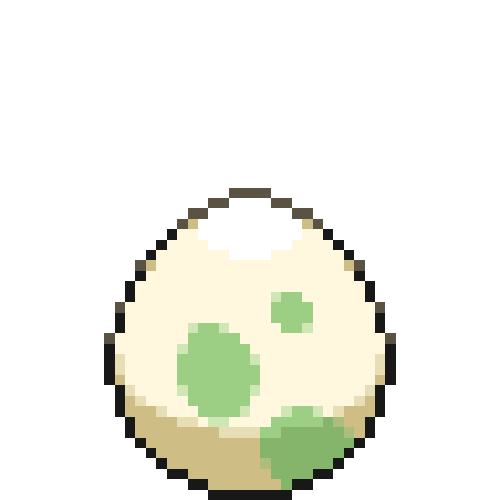
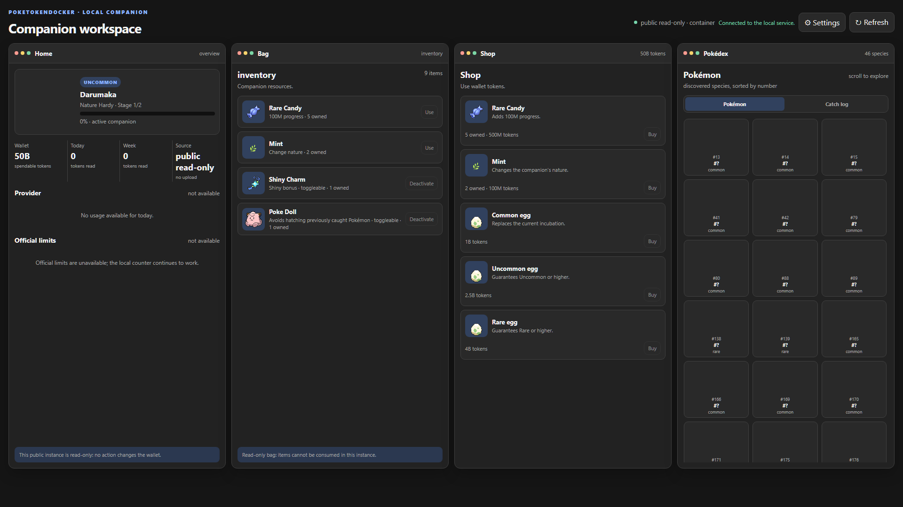
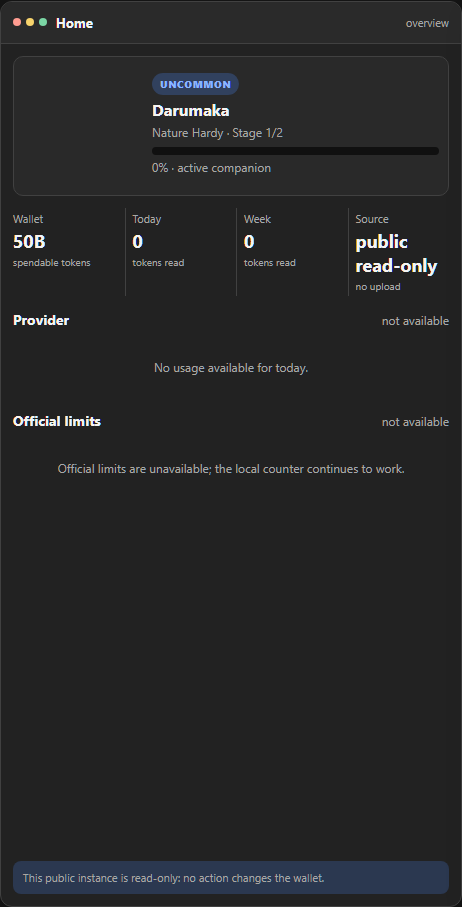
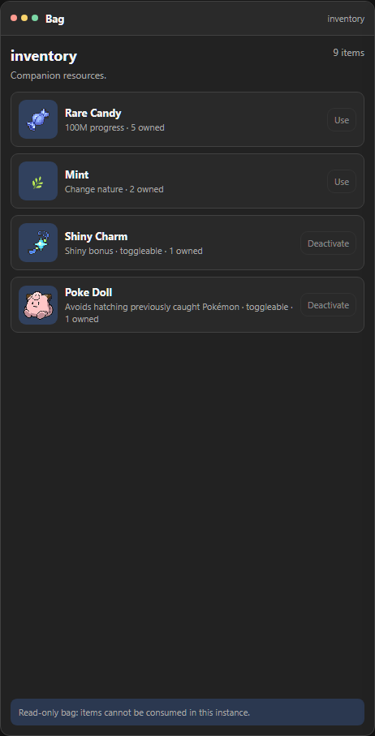
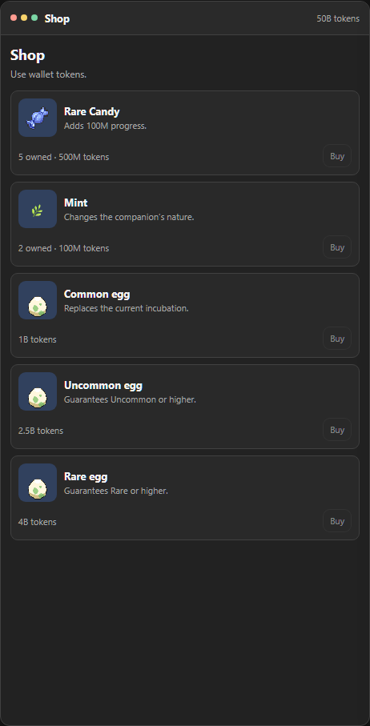
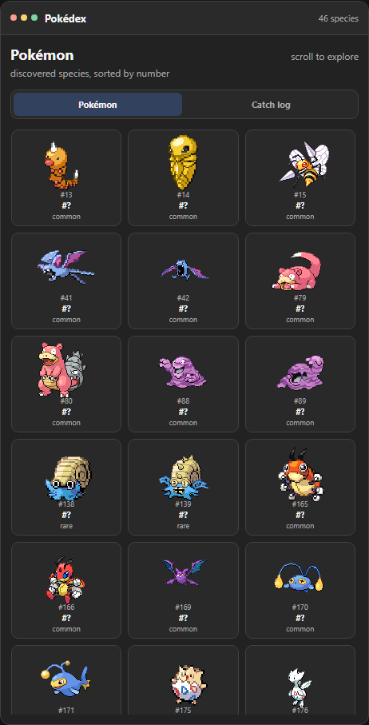
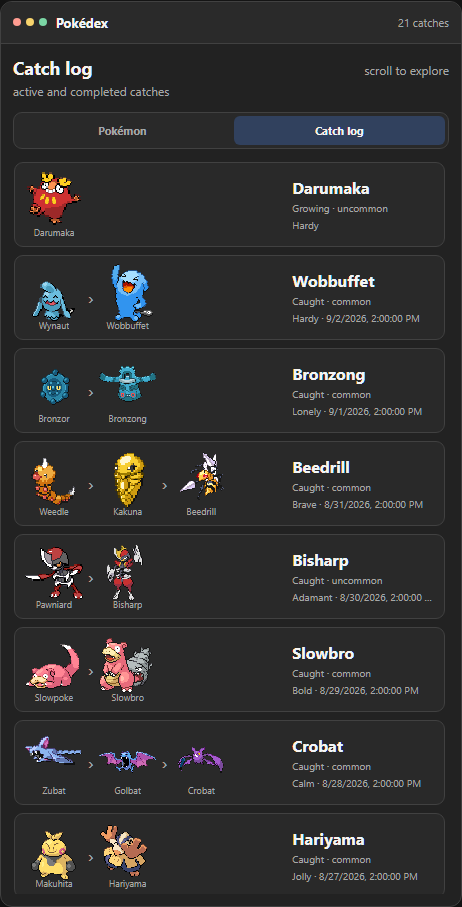
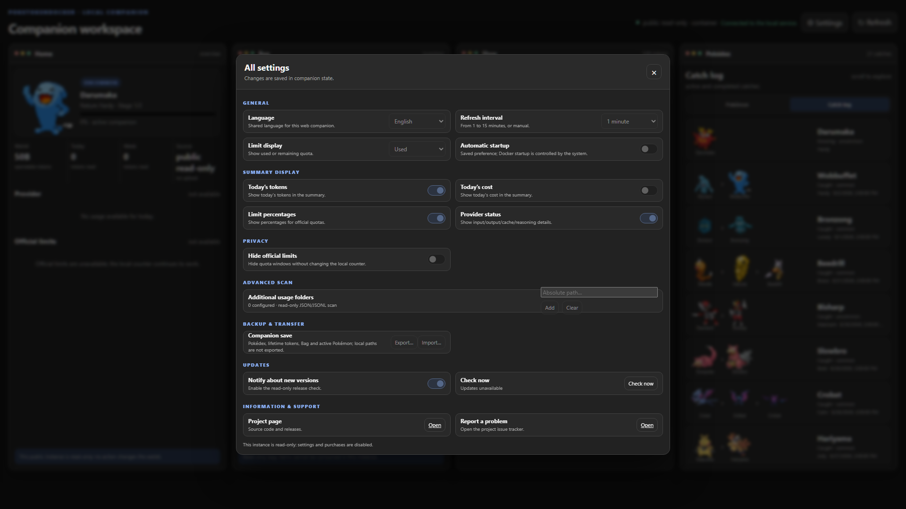
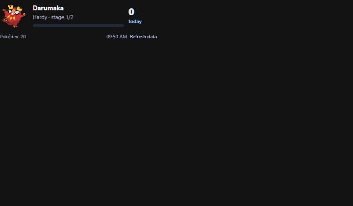

<p align="center">
  
</p>

<h1 align="center">PokeTokenDocker</h1>

<p align="center">
  <strong>Turn local AI coding usage into a Pokémon workspace.</strong><br>
  A local-first Docker service that turns usage metadata into progression, collection, and a focused web companion.
</p>

<p align="center">
  <a href="LICENSE"></a>
  <a href="docker/Dockerfile"></a>
  <a href="package.json"></a>
  <a href="https://ko-fi.com/marukoshi"></a>
</p>

<p align="center" aria-label="Language selector">
  <a href="README.md"><strong>🇬🇧 English</strong></a>
  &nbsp;|&nbsp;
  <a href="README.zh-CN.md">🇨🇳 简体中文</a>
  &nbsp;|&nbsp;
  <a href="README.it.md">🇮🇹 Italiano</a>
  &nbsp;|&nbsp;
  <a href="README.ja.md">🇯🇵 日本語</a>
  &nbsp;|&nbsp;
  <a href="README.ko.md">🇰🇷 한국어</a>
  &nbsp;|&nbsp;
  <a href="README.es.md">🇪🇸 Español</a>
  &nbsp;|&nbsp;
  <a href="README.fr.md">🇫🇷 Français</a>
  &nbsp;|&nbsp;
  <a href="README.pt.md">🇵🇹 Português</a>
</p>

> **Source package:** `0.1.0` · Docker/web build · The default Compose profile is `public-readonly`, local, and read-only.
>
> **Published image:** `ghcr.io/markussela/poketokendocker:0.1.0` · Set `PTD_IMAGE` to use a Docker Hub namespace or a locally built tag.

## About this project

PokeTokenDocker is the headless web build of the PokeTokenBar idea: local AI coding usage becomes an egg, then a companion, then a growing Pokédex. It is designed for a server, NAS, or trusted local machine where a Docker container can read usage metadata and serve the companion through a browser.

The service keeps the boundary explicit:

- Hermes and provider directories are mounted **read-only**;
- the companion writes only its own state under `/data` when a mutating local profile is explicitly enabled;
- the default `public-readonly` profile disables purchases, settings writes, imports, and other mutations;
- no SSH, Tailscale, Home Assistant, remote database, or telemetry service is required.

This repository is the Docker/web companion, not the Windows tray application. The two builds share the progression idea but have different runtimes and configuration names.

## ✨ What it does

- 🏠 **Presents a focused web workspace:** Home, Bag, Shop, Pokédex, Catch Log, and Settings live in one responsive page.
- 📈 **Turns usage into progression:** local token metadata advances the active egg or companion, including stages, rarity, nature, and graduation.
- 📚 **Builds a collection:** the Pokédex records discovered species while the Catch Log keeps each evolution chain and catch history.
- 🎒 **Adds a reward loop:** Rare Candy, Mint, Shiny Charm, Poké Doll, and egg tiers belong to the companion state, not to a provider account.
- 🔄 **Streams live state:** the browser receives snapshot and activity events through the SSE endpoint and can refresh without a full page reload.
- 🧩 **Supports a compact view:** [`web/mini.html`](web/mini.html) is intended for a trusted Homepage or iframe integration.
- 🌍 **Speaks seven UI languages:** English, Italian, Korean, Japanese, Spanish, French, and Portuguese are available in Settings.
- 🔒 **Starts safely:** Compose binds to loopback and runs in `public-readonly` mode unless you deliberately choose another profile.

## 🔁 How progression works

1. The container reads supported usage metadata from the read-only Hermes and provider mounts.
2. The local service normalizes token, cost, session, and provider totals.
3. New usage advances the active egg or the current evolution stage.
4. Hatch, evolution, rarity, nature, shiny, and collection state are kept in the companion state.
5. The WebUI renders the current snapshot and receives later updates over Server-Sent Events.

Progression state belongs to PokeTokenDocker. It never writes back to Hermes or to a provider source.

## 🔌 Supported local sources

The built-in readers currently cover:

- Claude Code
- Gemini
- Antigravity
- Codex
- OpenCode
- Cursor
- Grok
- GitHub Copilot
- Kiro
- Pi Agent
- Hermes Agent local SQLite usage

Additional JSON or JSONL folders can be configured from Settings when a local tool stores usage outside the built-in locations. Additional folders are scanned read-only.

Official quota windows are shown only when a source provides them. If quota information is unavailable, the interface says so instead of inventing a percentage or reset time.

## 📸 Screenshots

All images below were captured from an isolated synthetic fixture. They contain demonstration values only; they are not captures of the live service or of a personal account. The complete image policy and index are in [`docs/SCREENSHOTS.md`](docs/SCREENSHOTS.md).

<table>
  <thead>
    <tr>
      <th width="42%">Screenshot</th>
      <th align="left">What it shows</th>
    </tr>
  </thead>
  <tbody>
    <tr>
      <td align="center"></td>
      <td><strong>🏠 The workspace.</strong><br>Home, Bag, Shop, and Pokédex are visible together in the wide layout. The Home panel shows the active companion, progression, usage summary, provider rows, quota status, and the local-data boundary.</td>
    </tr>
    <tr>
      <td align="center"></td>
      <td><strong>📊 Home.</strong><br>The compact Home panel keeps the active companion, progression bar, wallet, today/week totals, provider metrics, official limits, and read-only notice in one place.</td>
    </tr>
    <tr>
      <td align="center">
        
        
      </td>
      <td><strong>🎒 Bag and 🛍️ Shop.</strong><br>Bag displays the local inventory and activation state. Shop lists progression items and egg tiers. In the default Docker profile the controls remain visible but mutations are disabled.</td>
    </tr>
    <tr>
      <td align="center">
        
        
      </td>
      <td><strong>📖 Pokédex and Catch Log.</strong><br>The Pokédex keeps discovered species in animated sprite cards. Catch Log shows each companion's evolution chain, rarity, nature, and neutral demonstration date.</td>
    </tr>
    <tr>
      <td align="center"></td>
      <td><strong>⚙️ Settings.</strong><br>Language, refresh cadence, summary display, privacy, extra read-only scan folders, save transfer, update checks, project links, and support are grouped in one dialog. The screenshot shows the default read-only boundary.</td>
    </tr>
    <tr>
      <td align="center"></td>
      <td><strong>🧩 Mini view.</strong><br>The standalone compact page is suitable for a trusted Homepage or iframe. Use `PTD_EMBED_ORIGIN` to allow one exact embedding origin; leave it empty when embedding is not needed.</td>
    </tr>
  </tbody>
</table>

## 🐳 Install with Docker Compose

Requirements:

- Docker Engine with Compose v2;
- a host directory containing the Hermes data that the container may read;
- a host directory or Docker-managed volume for the companion's own `/data` state;
- network access to the sprite URLs if you want the animated Pokédex images.

1. Clone the repository and enter it:

   ```shell
   git clone https://github.com/MarkusSela/PokeTokenDocker.git
   cd PokeTokenDocker
   ```

2. Create a local environment file from the safe template:

   ```shell
   cp docker/ptd.env.example .env
   ```

   On Windows PowerShell, use `Copy-Item docker/ptd.env.example .env`.

3. Edit `.env` and set `PTD_HERMES_DIR` to the Docker-host path containing Hermes data. Do not commit `.env`.

4. Pull the published image and start the default profile:

   ```shell
   docker compose -f docker/compose.yaml pull
   docker compose -f docker/compose.yaml up -d
   ```

   To build locally instead, use `docker compose -f docker/compose.yaml up -d --build`.

5. Open <http://127.0.0.1:4317/> and check the service:

   ```shell
   curl http://127.0.0.1:4317/healthz
   ```

The default profile uses `public-readonly`, binds to `127.0.0.1`, mounts Hermes at `/hermes:ro`, and stores companion state at `/data`. A healthy response looks like:

```json
{"ok":true,"service":"poketokendocker","mode":"public-readonly"}
```

The exact response is safe to expose, but usage snapshots may contain personal local data. Keep the service on loopback unless you have deliberately designed a trusted-LAN deployment.

## 🛡️ Runtime modes

| Mode | Compose entry point | Port | Mutations | Intended use |
| --- | --- | ---: | --- | --- |
| `public-readonly` | `poketokendocker` | `4317` | Disabled | Safe browser or read-only Homepage display. |
| `docker-local` | `poketokendocker-local-integration` profile | `4318` | Explicitly enabled | Local testing of purchases, settings, and companion-state writes. |

The local-integration profile is opt-in and binds to `127.0.0.1`. It uses a Docker-managed state volume and still reads Hermes/provider data without writing to those sources:

```shell
docker compose -f docker/compose.yaml --profile local-integration up -d --build poketokendocker-local-integration
```

Do not expose the mutating profile to an untrusted LAN. Use an isolated fixture for tests that change inventory, progression, settings, or wallet state.

## ⚙️ Configuration

The Compose file uses the `PTD_*` namespace. These variables are intentionally different from the Windows build's `PTB_*` settings.

| Variable | Default | Purpose |
| --- | --- | --- |
| `PTD_IMAGE` | `ghcr.io/markussela/poketokendocker:0.1.0` | Published image reference. Override it for Docker Hub or a local tag. |
| `PTD_HERMES_DIR` | required | Docker-host directory mounted read-only at `/hermes`. |
| `PTD_DATA_DIR` | `../data` | Docker-host directory mounted at `/data` for companion state. |
| `PTD_BIND_HOST` | `127.0.0.1` | Host interface used by the published port. |
| `PTD_ALLOWED_HOSTS` | loopback hosts | Host values accepted for mutating API requests. |
| `PTD_WEB_MODE` | `public-readonly` | Service mode. Use `docker-local` only with the explicit local profile. |
| `PTD_WEB_ALLOW_MUTATIONS` | `0` | Additional gate for mutating actions. Keep `0` for read-only deployments. |
| `PTD_EMBED_ORIGIN` | empty | One exact origin allowed by the Mini view's `frame-ancestors` policy. |
| `PTD_WEB_PORT` | `4317` | Port inside the container; normally leave it unchanged. |

`/hermes` and `/data` must be separate paths. The service refuses overlapping Hermes and companion paths.

## 🔗 HTTP surface

The service exposes a small browser/API surface:

- `GET /healthz` — container health response;
- `GET /api/capabilities` — mode and action capabilities;
- `GET /api/config` — public project, issue, and release links;
- `GET /api/snapshot` — sanitized companion snapshot;
- `GET /api/events` — Server-Sent Events for snapshots and activity;
- `POST /api/action` — capability-checked browser actions;
- `GET /mini.html` — compact iframe/Homepage view.

JSON responses are marked `no-store`. Mutating actions require JSON, same-origin host/origin checks, and an enabled capability. The snapshot contract removes private paths, raw provider records, credentials, and unrelated state before data reaches the browser.

## 🔒 Privacy and data boundaries

PokeTokenDocker is local-first by design:

- Hermes and provider directories are read-only mounts;
- only the companion's own state belongs in `/data`;
- the default profile has no mutating actions;
- there is no telemetry or analytics upload in this repository;
- prompts, credentials, API keys, cookies, tokens, connection strings, database files, logs, and state exports must not be committed;
- the update checker reads the configured public GitHub release endpoint and does not need a GitHub token;
- an exported companion save is personal data and should be handled like a backup.

Read [`SECURITY.md`](SECURITY.md) before exposing the page beyond loopback. The release audit rejects personal paths, credential-looking values, local databases, logs, and companion state.

## 🧪 Build and verify from source

Requirements: Node.js 22 or newer and npm.

```shell
npm ci
npm test
node scripts/audit-release.cjs
npm audit --omit=dev --audit-level=high

# Pull the public image (or use Compose as shown above)
docker pull ghcr.io/markussela/poketokendocker:0.1.0

# Build a local image instead
docker build -f docker/Dockerfile --build-arg VERSION=0.1.0 -t poketokendocker:local .
```

The Docker image runs as the unprivileged `node` user, includes only production dependencies, exposes port `4317`, and has a `/healthz` healthcheck.

For contributions, use synthetic data and read [`CONTRIBUTING.md`](CONTRIBUTING.md). Do not attach Hermes databases, provider logs, prompts, credentials, cookies, or exported saves to issues or pull requests.

## 🔗 Links

- [Project repository](https://github.com/MarkusSela/PokeTokenDocker)
- [Container image on GHCR](https://github.com/MarkusSela/PokeTokenDocker/pkgs/container/poketokendocker)
- [Container registry instructions](docs/CONTAINER-REGISTRIES.md)
- [Releases](https://github.com/MarkusSela/PokeTokenDocker/releases)
- [Report an issue](https://github.com/MarkusSela/PokeTokenDocker/issues/new)
- [Windows companion build](https://github.com/MarkusSela/PokeTokenBarWindows-Lab)
- [Original PokeTokenBar project](https://github.com/chattymin/PokeTokenBar)
- [Screenshot policy](docs/SCREENSHOTS.md)
- [Security notes](SECURITY.md)

## 💛 Support

If PokeTokenDocker is useful to you, support maintenance on [Ko-fi](https://ko-fi.com/marukoshi). Support helps with upkeep, testing, and interface polish; it never grants access to usage data and never replaces the local privacy boundary.

## 🙏 Acknowledgments

Thanks to the original [PokeTokenBar project](https://github.com/chattymin/PokeTokenBar) for the companion concept and progression loop that inspired this build.

This project also uses:

- [Docker](https://www.docker.com/) and [Node.js](https://nodejs.org/) for the service runtime;
- [sql.js](https://github.com/sql-js/sql.js) for safe local SQLite reads;
- [PokéAPI](https://pokeapi.co/) and the [PokéAPI sprites repository](https://github.com/PokeAPI/sprites) for Pokémon data and imagery;
- the maintainers of the local AI tools whose usage formats make read-only aggregation possible.

## 📄 License

The source code in this repository is released under the [MIT License](LICENSE). The license applies to this project's source code and does not grant rights to third-party trademarks, artwork, or data accessed through the service.

PokeTokenDocker is an unofficial, non-commercial fan project. It is not affiliated with, endorsed, sponsored, or approved by Nintendo, Game Freak, Creatures Inc., or The Pokémon Company. “Pokémon” and related names, characters, and imagery belong to their respective owners.

The service is provided “as is”, without warranty of any kind. This notice is not legal advice.
